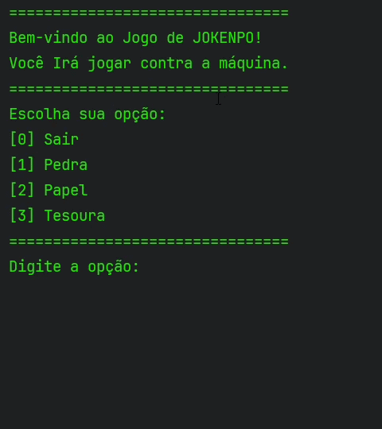

## 🎮 Jokenpô em Java

Um jogo clássico de **Pedra, Papel e Tesoura** desenvolvido em Java, executado diretamente no terminal.

## 🎥 Demonstração

<p align="center">
  
</p>

---

## 🧠 Funcionalidades

- 🤖 Jogador vs Computador  
- 🎲 Escolha aleatória da máquina  
- 💬 Mensagens dinâmicas para vitória, derrota e empate  
- 🖥️ Interface simples via console  

## 🛠️ Próximas melhorias

- 🔄 Modo **Melhor de 3**  
- 📊 Sistema de pontuação  
- 🔁 Loop contínuo de jogo  
- 🎯 Validação de entrada mais robusta  

---

## 🚀 Como executar

```bash
javac Main.java
java Main
````

## 📚 Tecnologias utilizadas

- Java
- Programação Orientada a Objetos (POO)
- Estruturas básicas (arrays, condicionais e loops)

## 💡 Objetivo

Projeto desenvolvido com foco em praticar lógica de programação e fundamentos do Java, evoluindo com novas funcionalidades ao longo do tempo.
